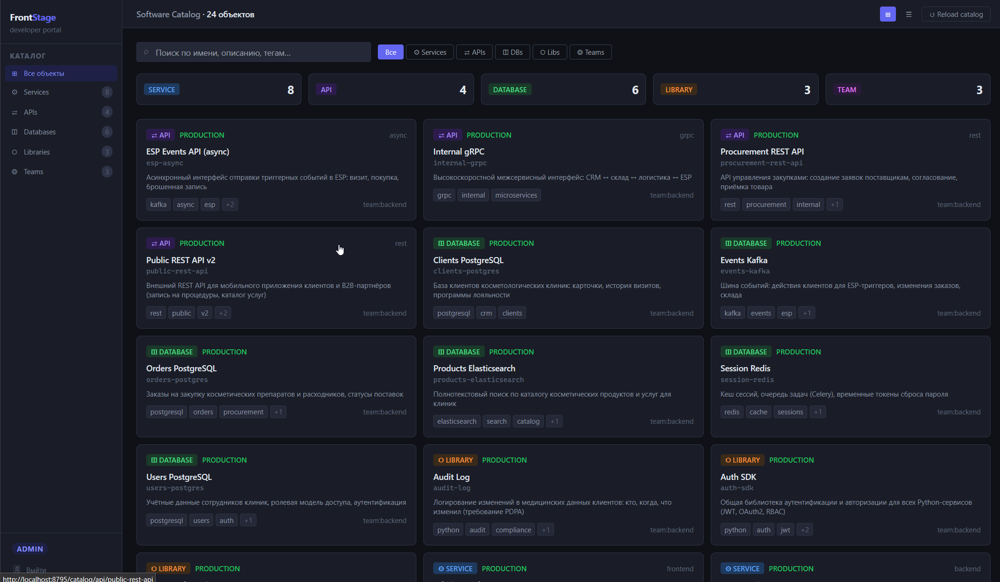
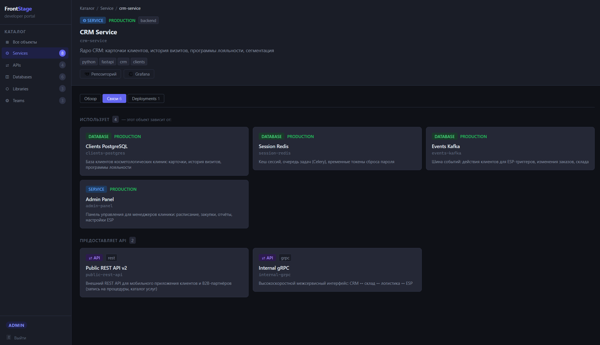
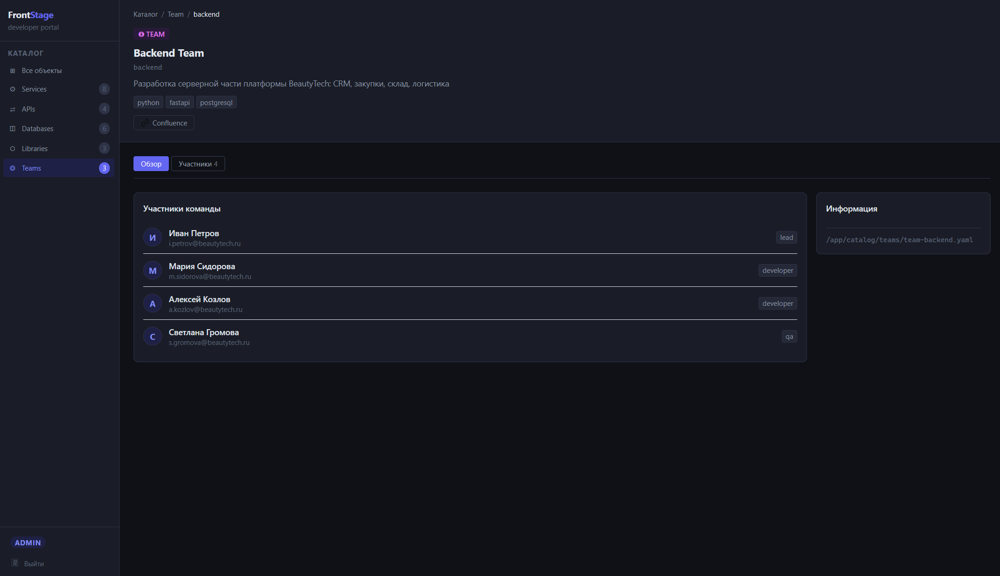

# FrontStage

A lightweight open-source developer portal — a Backstage alternative that's easy to deploy and maintain on your own.

## Why FrontStage if Backstage exists?

Backstage is powerful but heavy: Node.js, TypeScript, React plugins, complex deployment, and a steep learning curve. FrontStage solves the same problem — a single portal for your teams — without the unnecessary complexity.

| Category          | FrontStage           | Backstage                  |
| ----------------- | -------------------- | -------------------------- |
| Server stack      | Python / FastAPI     | Node.js / TypeScript       |
| Frontend          | Alpine.js + Tailwind | React + Material UI        |
| Configs           | YAML                 | YAML + TypeScript plugins  |
| DB / Cache        | Redis                | PostgreSQL                 |
| Customization     | Python / Jinja       | React plugin system        |
| License           | MIT                  | Apache 2.0                 |
| Recommended RAM   | 1 GB                 | 16 GB                      |
| Recommended CPU   | 0.8 CPU              | 4 CPU                      |

**Key advantages:**

- DevOps teams understand the stack — it's Python. No dedicated frontend developer needed.
- Alpine.js instead of React: templates are transparent, easy to debug and extend.
- Swagger documentation out of the box — straightforward to integrate any backends.
- Simple, readable code in a single repo — easy to customize yourself or with AI assistants.
- Great fit for enterprise AI/RAG: structured YAML data is easy to index.
- The FrontStage developer and community focus on resource consumption optimization.

_Backstage problems — [debunking.en.md](./debunking.en.md)_

## Features

### Software Catalog

A centralized registry of all services, libraries, APIs, databases, and their owners.

Solves the "who owns this microservice?" problem — all infrastructure information in one place, in Git, in a readable format.

Catalog entities: `Service`, `API`, `Database`, `Library`, `Team`.

## Quick Start

You can use an LLM to quickly generate configs from your existing documentation:

```bash
mv catalog catalog_example

claude -p 'Based on @docs/catalog/SPEC.md and the example in @catalog_example — create ./catalog for my team and services: [paste your docs here]'
```

```bash
docker network create my-proxy-network
docker compose up -d --build
```

Open: http://localhost:8795/







## Tech Stack

- **Server:** Python 3.10+, FastAPI, Jinja2, Nginx
- **Frontend:** Alpine.js, Tailwind CSS
- **Cache:** Redis
- **Configs:** YAML
- **Deploy:** Docker, Docker Compose
